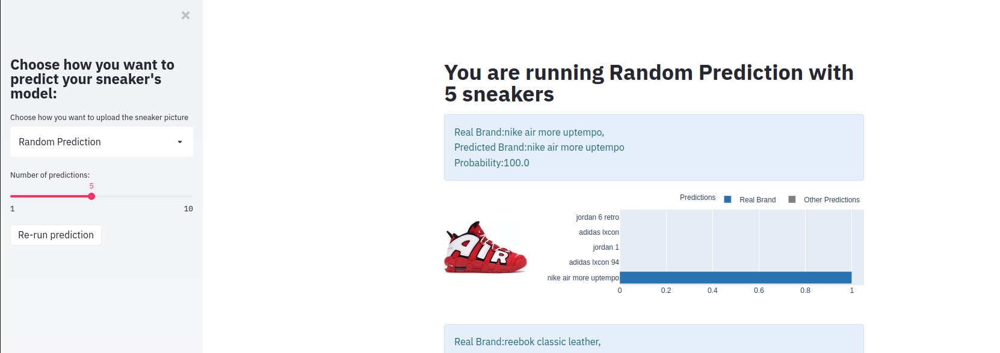
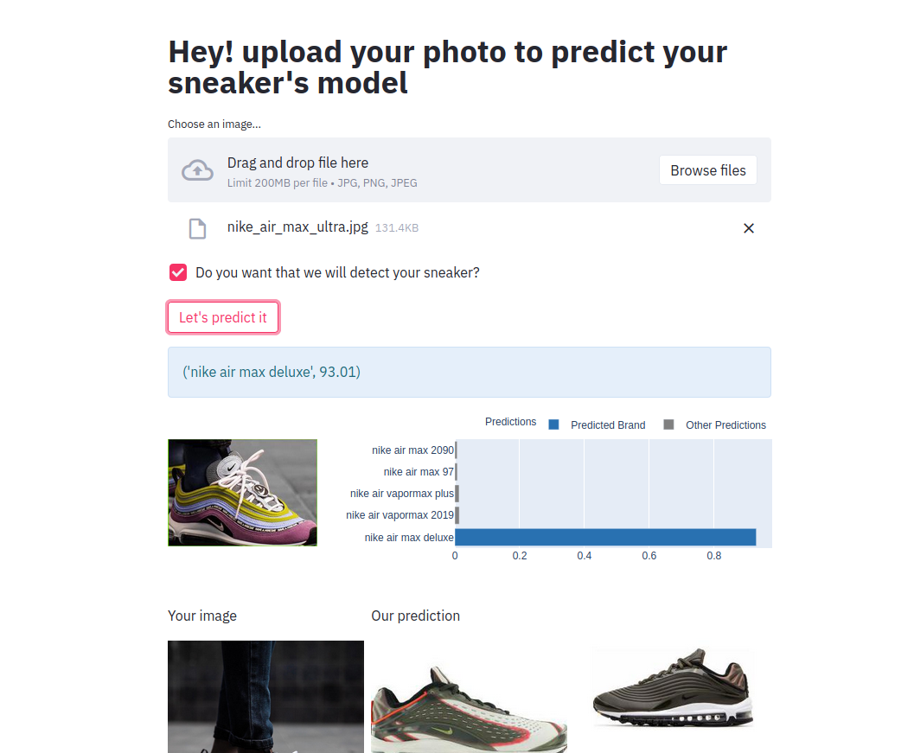
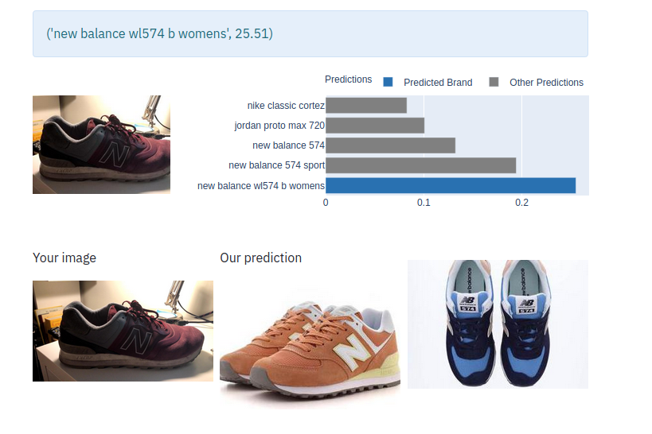
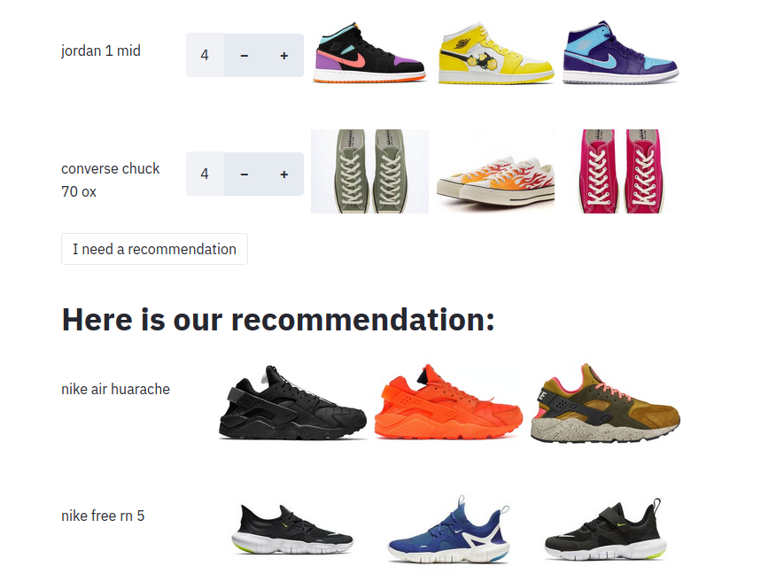

# SneakerZam
## Final Proyect - Ironhack

  

## Table of Contents  

* [About the Project](#about-the-project) 
  * [Data]()
  * [Random Prediction](#pushpin-challenge-1)  
  * [Prediction uploading](#pushpin-challenge-2)  
  * [Take a picture with your camera ](#pushpin-challenge-3)      
  * [Recommendation System](#pushpin-challenge-3)     

* [How was it made?](#how-to-use-the-pipeline)  
  * [How was built?](#hammer-built-with)  
  * [Prerequisites](#page_with_curl-prerequisites)  
  * [Inputs](#computer-inputs)  
  * [Folder Structure](#file_folder-folder-structure)  
 * [Procesing Stages](#procesing-stages)
      * [Acquistion](#electric_plug-acquisition)  
      * [Wrangling](#wrench-wrangling)  
      * [Analysis](#rocket-analysis)  
      * [Reporting](#mailbox-reporting)  
* [Next Stages](#next-stages) 
  
## About the project  

SneakerZam is a python algorithm that predict sneaker's model. Based on a Convolutional Neuronal Network, the algorithm will predict which sneakers is shown on a given picture.

### :bookmark_tabs: Data
  
To create a big database, I started using [Sneakers Databased Api](https://app.swaggerhub.com/apis-docs/tg4solutions/the-sneaker-database/1.0.0#/sneakers/getSneakers). the problem was that there are a lot of sneakers models with a few images. We solved this problem with web scrapping and Selenium. The database grown to 80k images and after several filters, it ended in a database with 30k group by 504 models. 
  
### :pushpin: Random Prediction



  
###  :pushpin: Prediction uploading img
  

  
  
###  :pushpin: Take a picture with your camera  



###  :pushpin: Recommendation System  
  



  ###  :hammer: Built With   
The core of the project is Python 3.7.3, but you have to install those libraries for run the script.   

- [Pandas (v.0.24.2)](https://pandas.pydata.org/pandas-docs/stable/reference/index.html)  


  
## **How to use the app**
###  **:page_with_curl:Prerequisites**  
Please, install all the libraries mentinoned in [Built With](#built-with) in your enviroment in order to run the script.  
  
  
### **:computer: Inputs**  
 
  
### :file_folder: **Folder structure**  
```
└── sneakerzam   
    ├── requeriments.txt  
    ├── README.md  
    ├── notebooks  
    │   └── cnn_shoe_prediction.ipynb  
    │   
    └── streamlit
        │   ├── __init__.py  
        │   └── m_acquisition.py  
        ├── p_model 
        │   ├── __init__.py  
        │   └── m_model.py  
        ├── p_reporting  
        │   ├── __init__.py  
        │   └── m_reporting.py  
        └── p_recommender_system  
            ├── __init__.py  
            └── m_rs.py  

  

## **Processing stages**  
  
 ---  
### ** Next stages**  

